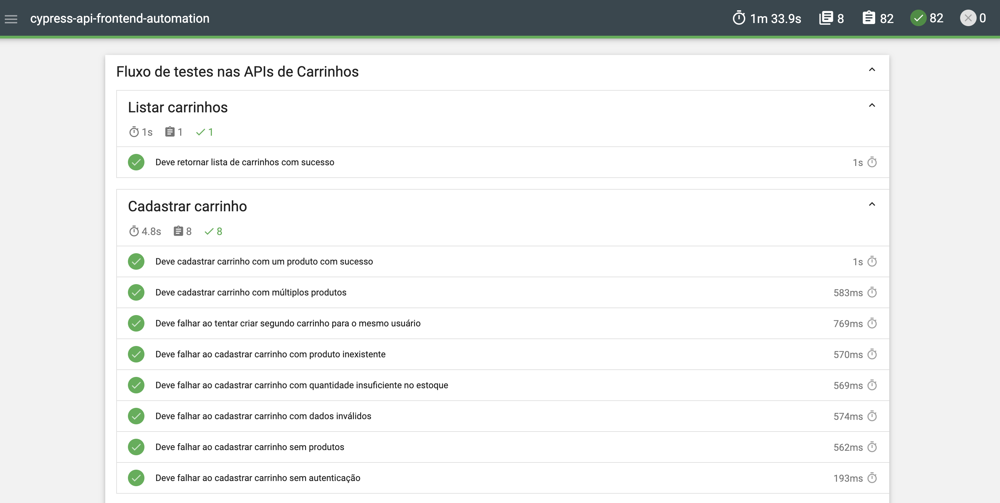

# 🧪 Testes Automatizados de API e Frontend


Este projeto demonstra a implementação de testes automatizados de API e Frontend utilizando **Cypress** com **TypeScript**, com uma arquitetura modular, escalável e multiambiente. A aplicação alvo é a [ServerRest](https://serverest.dev).

- **Frontend:** https://front.serverest.dev  
- **API & Documentação:** https://serverest.dev

## 📋 Pré-requisitos

Antes de executar os testes, certifique-se de ter instalado:

### **Node.js (Obrigatório)**
- **Versão mínima:** 16.x ou superior (recomendado: 18+)
- **Download:** [https://nodejs.org/](https://nodejs.org/)
- **Verificar instalação:** 
  ```bash
  node --version
  npm --version
  ```

## ⚙️ Instalação e Configuração

### 1. Clone o repositório

```bash
git clone https://github.com/jimmy-pontes/cypress-api-frontend-automation.git
cd cypress-api-frontend-automation
```

### 2. Instale as dependências

```bash
npm install
```

## 🚀 Execução dos Testes

Os comandos personalizados estão definidos no arquivo package.json

### Interface do Cypress

```bash
npm run open
```

Abre a interface gráfica do Cypress, permitindo selecionar os testes manualmente e acompanhar a execução em tempo real.

### Execução em terminal (headless)

```bash
npm run all
```

Executa todos os testes automaticamente no terminal, exibindo apenas os resultados.

### Execução de teste específico

```bash
npm run spec --spec="cypress/e2e/caminho/do/teste.cy.ts"
```

Executa apenas o arquivo de teste especificado.

### Execução de todos os testes de uma pasta

```bash
npm run spec --spec="cypress/e2e/caminho/da/pasta"
```

Executa todos os testes contidos na pasta especificada.

### Definindo o ambiente de execução

Para rodar os testes em um ambiente específico, adicione o parâmetro `ENV` antes do comando:

- Para Windows:
```bash
$env:ENV = "staging"; npm run {comando}
```

- Para MacOs
```bash
ENV=staging npm run {comando}
```


## 🚀 CI/CD

O projeto possui integração contínua via **GitHub Actions**. O workflow é disparado automaticamente em:

- **Push** na branch `main`
- **Pull Request** direcionado à branch `main`

### O que acontece em cada execução

1. O ambiente é provisionado com **Ubuntu** e **Node.js 20**
2. As dependências são instaladas via `npm ci`
3. Todos os testes são executados em modo headless
4. O relatório **Mochawesome** é gerado automaticamente
5. O relatório é publicado como **artefato** do workflow, disponível para download por 7 dias

O relatório é gerado e publicado mesmo quando há testes falhando, garantindo visibilidade completa dos resultados.

### Como acessar o relatório da pipeline

1. Acesse a aba **Actions** no repositório do GitHub
2. Selecione a execução do workflow desejada
3. Na seção **Artifacts**, baixe o arquivo **mochawesome-report**
4. Extraia o ZIP e abra o `report.html` no navegador

## 📊 Relatório de Testes (Mochawesome)

O projeto utiliza o **Mochawesome** para gerar relatórios HTML visuais com gráficos de testes passados, falhos e pendentes. Screenshots de falhas são embutidas automaticamente no relatório.

### Gerar o relatório

```bash
npm run report
```

Este comando executa todos os testes, faz o merge dos resultados e gera o relatório HTML automaticamente.

### Visualizar o relatório

Após a execução, abra o arquivo gerado no navegador:

```bash
open cypress/reports/report.html
```

No Windows:
```bash
start cypress/reports/report.html
```

O relatório será gerado em `cypress/reports/report.html`.

### Exemplo do relatório



## 🗂️ Estrutura do Projeto

```
cypress-api-frontend-automation/
├── cypress/
│   ├── e2e/
│   │   ├── api-tests/           → Testes de API
│   │   └── frontend-tests/      → Testes da interface web
│   ├── fixtures/                → Dados de teste (JSON)
│   ├── mappings/
│   │   ├── routes/              → Rotas do backend
│   │   └── selectors/           → Seletores do frontend
│   ├── screenshots/             → Screenshots dos testes
│   └── support/
│       ├── commands.ts          → Comandos personalizados tipados
│       ├── config.ts            → Configuração de URLs por ambiente
│       ├── cypress.d.ts         → Declarações de tipos globais
│       ├── e2e.ts               → Centralização das importações
│       └── types.ts             → Interfaces do projeto
├── cypress.config.js            → Configuração principal do Cypress
├── tsconfig.json                → Configuração do TypeScript
├── package.json                 → Dependências e scripts
└── README.md                    → Documentação do projeto
```


## 🧠 Arquivos principais da arquitetura


#### 📄 `support/commands.ts`

Este arquivo centraliza todas os comandos personalizados que são chamados nos arquivos de teste.

- Comandos que fazem diversas verificações e ações constantes nos testes.
- Possibilita testes menos verbosos chamando comandos específicos.
- Melhor manutenção e centralização de código.

**Exemplos de commands:**
```javascript
cy.generateUser()        // Gera dados de usuário
cy.createUser()          // Cria usuário via API
cy.fazerLoginCompleto()  // Login completo via Frontend
cy.visitLoginPage()      // Navega para página de login
```

#### 📄 `support/e2e.ts`

Este arquivo centraliza todas as configurações e importações necessárias para a execução dos testes.

- É carregado automaticamente pelo Cypress ao iniciar os testes.
- Nele são importados módulos como `commands.ts`, `config.ts`, além das variáveis de ambiente.
- Garante que todas as dependências estejam disponíveis globalmente nos testes, evitando importações repetidas em cada arquivo de teste.


#### 📄 `support/config.ts`

Este arquivo define as **URLs base** utilizadas durante a execução dos testes, separadas por ambiente.


#### 📄 `cypress.config.js`

Este arquivo é o ponto central de configuração do Cypress. Ele define o comportamento global dos testes e, neste projeto, permite a execução dos testes por ambiente (`dev`, `staging`, `prod`).

## 🎯 Cenários de Teste Implementados

### **API Tests:**
- ✅ **Login:** Autenticação com diferentes tipos de usuário
- ✅ **Usuários:** CRUD completo de usuários
- ✅ **Produtos:** CRUD completo de produtos
- ✅ **Carrinhos:** Gerenciamento de carrinho de compras
- ✅ **Cadastro:** Validações de cadastro via API

### **Frontend Tests:**
- ✅ **Login:** Fluxo completo de autenticação via interface
- ✅ **Cadastro:** Validações de cadastro via formulário
- ✅ **Lista de Compras:** Adição de produtos à lista

## ✅ Boas Práticas Implementadas

- **TypeScript** com interfaces tipadas, declarações globais e autocomplete completo.
- Arquitetura multiambiente para testes isolados e realistas.
- Separação clara entre testes de API e Frontend.
- Comandos customizados tipados e reutilizáveis para reduzir duplicações.
- **cy.intercept()** para validação de chamadas de rede nos testes de frontend.
- Geração de dados dinâmicos com **Faker.js** em todos os pontos do projeto.
- Relatório visual com **Mochawesome** (HTML com gráficos e screenshots de falhas).
- **CI/CD** com GitHub Actions, gerando relatório como artefato automaticamente.


## 📌 Requisitos

- Node.js (versão recomendada: 18+)
- Cypress (instalado via `npm install`)


## 👤 Autor

**Jimmy Pontes**  
QA Engineer Sênior | Test Automation | Web | API | Mobile

---

> Este projeto visa demonstrar boas práticas em automação de testes com Cypress.